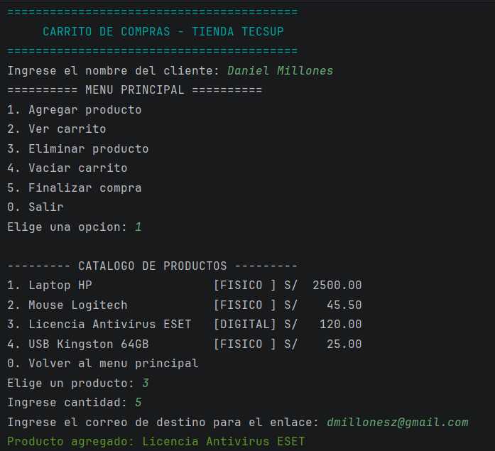
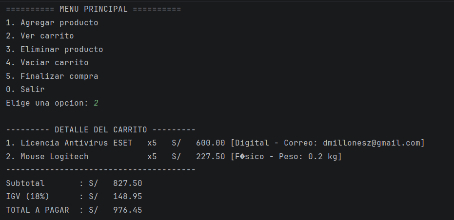
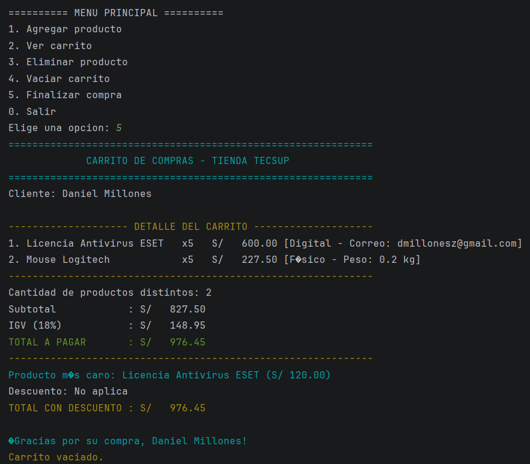

# Sistema Carrito de Compras  - Tienda Tecsup

Este es un sistema de carrito de compras por consola desarrollado en Kotlin. El proyecto aplica de manera rigurosa los pilares fundamentales de la Programación Orientada a Objetos (POO), implementa un patrón de arquitectura por capas y cuenta con un robusto diseño defensivo para el control de errores e interactividad fluida.

## 🚀 Características Principales

- **Orientación a Objetos Avanzada:** Implementación explícita de Abstracción, Encapsulamiento, Herencia y Polimorfismo.
- **Solución de Firmas JVM:** Uso de la anotación `@JvmName` para evitar conflictos de firmas en los getters analizados por la máquina virtual de Java, manteniendo variables encapsuladas mutables (`var`) requeridas por el bloque de validación.
- **Arquitectura por Capas:** Separación limpia de responsabilidades dividida en `model` (datos y reglas de negocio individuales), `service` (lógica operacional del carrito) y `main` (interfaz de usuario por consola).
- **Control Defensivo de Errores:** Uso obligatorio de `toIntOrNull()` y `toDoubleOrNull()`, evitando interrupciones inesperadas (*crashes*) ante datos incorrectos de teclado.
- **Formato Visual Mejorado:** Interfaz interactiva en consola que incorpora códigos de escape ANSI para colores de estado y tablas alineadas.

---

## 📐 Demostración de Pilares POO en el Código

1. **Abstracción:** Representación del dominio de una tienda mediante clases dedicadas (`Producto`, `Cliente`, `Carrito`).
2. **Encapsulamiento:** Atributos de clase definidos como `protected` o `private`. El estado interno del carrito (`_items`) se encuentra oculto y solo se expone externamente mediante una lista de solo lectura (`.toList()`) para evitar manipulaciones corruptas externas.
3. **Herencia:** La clase base `Producto` se define como abierta (`open`), permitiendo la extensión funcional hacia clases hijas especializadas: `ProductoFisico` y `ProductoDigital`.
4. **Polimorfismo:** El método `mostrarDetalle` es redefinido (`override`) en las clases hijas. Al listar el carrito, el sistema determina dinámicamente en tiempo de ejecución si el objeto procesado es físico o digital, imprimiendo sus características particulares de forma automática sin que el servicio conozca el tipo explícito.

---

## 📁 Estructura del Proyecto

```text
carrito-compras/
 ├── src/
 │   └── main/
 │       └── kotlin/
 │           └── com/
 │               └── millones/
 │                   └── carrito_consola/
 │                       ├── model/
 │                       │   ├── Producto.kt        (Clase base abierta con @JvmName)
 │                       │   ├── ProductoFisico.kt  (Clase hija para bienes tangibles)
 │                       │   ├── ProductoDigital.kt (Clase hija para licencias/software)
 │                       │   └── Cliente.kt
 │                       ├── service/
 │                       │   └── Carrito.kt         (Lógica e impresión de boleta)
 │                       └── main/
 │                           └── Main.kt            (Interfaz de usuario y catálogo)
```

---

## 🛠️ Reglas de Negocio Implementadas

- **Validación Automática (`init`/`validar`):** Los precios negativos se corrigen automáticamente a `0.0` con un mensaje de advertencia. Las cantidades menores o iguales a cero se inicializan en `1`. Los textos vacíos se reemplazan por identificadores genéricos.
- **Automatización de Datos de Empresa:** El peso de los productos físicos es gestionado internamente por el catálogo de la empresa. El sistema no interrumpe al usuario solicitando datos técnicos que ya se conocen en inventario.
- **Despacho Digital Seguro:** Al elegir productos virtuales, el sistema solicita interactivamente el correo del cliente, contando con un respaldo defensivo institucional si el campo se deja en blanco.
- **Impuestos y Beneficios:** Aplicación automática del 18% de IGV y un descuento condicional del 5% si el valor bruto acumulado supera los `S/ 3000.00`.
- **Cierre del Ciclo de Venta:** Siguiendo la lógica comercial real, una vez emitido el recibo final mediante la opción de pago, el carrito se **vacía automáticamente** quedando limpio y listo para procesar una nueva transacción en el establecimiento.

---

## 🎮 Guía de Uso del Sistema

Al ejecutar el programa en tu entorno de desarrollo, el flujo interactivo de la consola te guiará con las siguientes acciones:

1. **Identificación:** El sistema solicitará ingresar el nombre del cliente para personalizar las boletas.
2. **Navegación del Menú:** Dispondrás de un panel de opciones numéricas del `0` al `5`:
   - **Opción 1 (Agregar Producto):** Despliega el catálogo institucional integrado por bienes físicos (`Laptop HP`, `Mouse Logitech`, `USB Kingston`) y licencias lógicas (**`Licencia Antivirus ESET`**). Al añadir uno, el flujo varía dinámicamente según su naturaleza.
   - **Opción 2 (Ver Carrito):** Visualiza los ítems agregados con sus etiquetas dinámicas correspondientes y subtotales parciales.
   - **Opción 3 (Eliminar Producto):** Lista los productos en pantalla y solicita el ID visual para removerlo limpiamente del inventario recalculando los índices base cero de la lista.
   - **Opción 4 (Vaciar Carrito):** Limpia la lista completa de compras manualmente.
   - **Opción 5 (Finalizar Compra):** Emite el comprobante de pago estructurado en formato de tabla, detallando impuestos, producto estrella, descuentos calculados y limpia el estado del carrito para el siguiente cliente.

---

## 📸 Evidencia de Ejecución (Resultado)

A continuación, se detalla el comportamiento visual del sistema tras simular la adquisición de licencias virtuales y periféricos:





