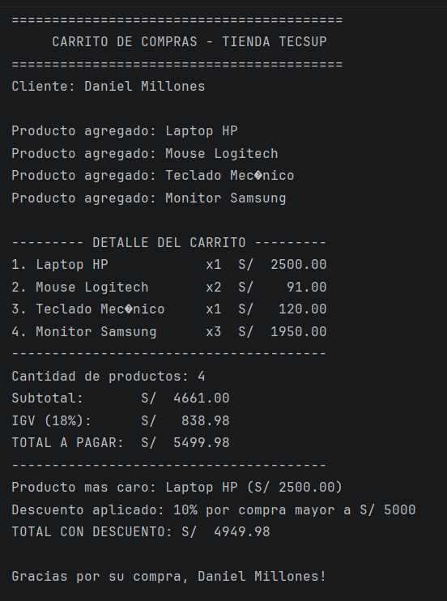

# Laboratorio 2 - Carrito de Compras en Kotlin

**Nombre completo:** Millones Vasquez, Daniel 
**Curso:** Programación en Móviles
**Sección:** D

## Descripción

Este programa simula el flujo de compra de un carrito de tienda, ejecutado por consola en Kotlin. Modela los productos con una `data class`, permite agregarlos a una lista mutable, calcula el subtotal, el IGV (18%) y el total a pagar, identifica el producto más caro del carrito, y aplica un descuento automático según el monto total de la compra (5% si supera S/ 3000, 10% si supera S/ 5000).

## Funciones implementadas

- **`calcularSubtotal(productos: List<Producto>): Double`** — recorre la lista de productos y suma el resultado de `precio * cantidad` de cada uno.
- **`calcularIGV(subtotal: Double): Double`** — devuelve el 18% del subtotal.
- **`calcularTotal(subtotal: Double, igv: Double): Double`** — devuelve la suma del subtotal más el IGV.
- **`calcularDescuento(total: Double): Double`** — usa una estructura `when` para determinar el descuento: 10% si el total supera S/ 5000, 5% si supera S/ 3000, y 0 en cualquier otro caso.
- **`mostrarDetalle(productos: List<Producto>)`** — imprime el detalle del carrito en formato de tabla, usando `String.format` para alinear las columnas de nombre, cantidad e importe.

## Captura de la consola (resultado final)

## Análisis: val vs var (Parte 2)

**¿Por qué `nombre` y `precio` son `val` pero `cantidad` es `var`?**

`nombre` y `precio` se declaran como `val` porque son atributos que no deberían cambiar una vez creado el producto: el nombre identifica al producto y el precio es su valor de catálogo, ambos fijos mientras ese objeto exista. En cambio, `cantidad` se declara como `var` porque sí es un dato que cambia con naturalidad durante el uso del carrito, por ejemplo cuando el cliente agrega o quita unidades del mismo producto.

**¿Qué pasaría si intentas cambiar el precio después de crear el producto?**

El código no compilaría. Kotlin lanza el error `Val cannot be reassigned` porque `precio` fue declarado como `val`, lo cual indica al compilador que su valor es de solo lectura después de la inicialización. Si se necesitara un producto con un precio distinto, habría que crear una nueva instancia de `Producto` en lugar de modificar la existente.
