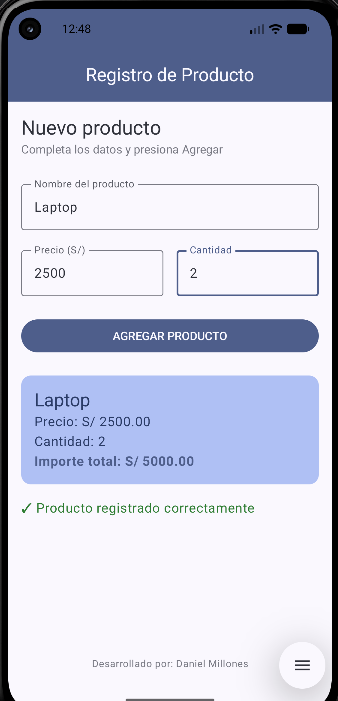

# Lab03 - Registro de Producto

**Autor:** Daniel Millones

## Descripción

Aplicación Android desarrollada en Jetpack Compose que permite registrar un producto
ingresando su nombre, precio y cantidad. Al presionar "AGREGAR PRODUCTO", la app calcula
el importe total (precio × cantidad) y muestra un resumen en una Card, junto con un mensaje
de confirmación. Si algún campo no es numérico, la app no se cae gracias al uso de
`toDoubleOrNull()` / `toIntOrNull()` con el operador Elvis (`?:`).

## Capturas de pantalla

### Pantalla inicial (sin productos registrados)


### Pantalla con producto registrado


## Pregunta: ¿Qué pasaría si las variables de los campos se declaran SIN `remember`?

Si se declaran así:

```kotlin
var nombre by mutableStateOf("")
```

en lugar de:

```kotlin
var nombre by remember { mutableStateOf("") }
```

Al probarlo, el texto escrito en el campo **se pierde cada vez que la función se recompone**
(por ejemplo, al rotar la pantalla, o al presionar el botón "AGREGAR PRODUCTO" y cambiar el
estado `mostrarResumen`). Esto sucede porque `mutableStateOf("")` sin `remember` crea un
**nuevo estado en cada recomposición**, en lugar de conservar el valor anterior.

`remember` le indica a Compose que debe **recordar** ese valor entre recomposiciones dentro
del mismo ciclo de vida del composable, guardándolo en memoria mientras el composable
permanezca en pantalla. Sin él, cada recomposición "olvida" el estado y lo reinicia a su
valor inicial (`""` en este caso), haciendo que la app sea inutilizable para capturar datos
del usuario de forma persistente.