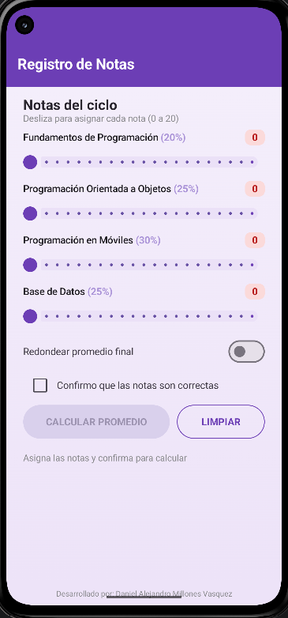
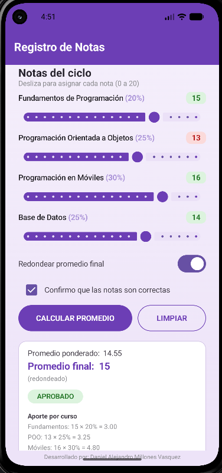
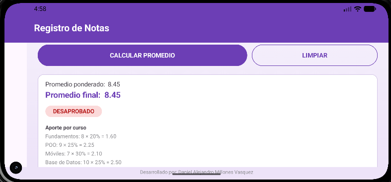

# Registro de Notas — Semana 3

Aplicación Android desarrollada en **Kotlin + Jetpack Compose** que calcula el promedio ponderado de 4 cursos de programación, usando controles nuevos: `Slider`, `Switch` y `Checkbox`.

- **Package:** `com.millones.registronotas`
- **minSdk:** 24 · **targetSdk:** 36 · **compileSdk:** 37

---

## I. Resultado esperado

| Figura 1 — Estado inicial            | Figura 2 — Promedio calculado        |
|--------------------------------------|--------------------------------------|
|  |  |

Notas en 0, botón deshabilitado (gris) hasta marcar el checkbox.

**Figura 3.** La app en orientación horizontal, con las notas, el Switch, el Checkbox y la tarjeta de resultado conservados gracias a `rememberSaveable` tras rotar el dispositivo.



---

## II. Requisitos funcionales cumplidos

- [x] Barra superior morada "Registro de Notas" + fondo con degradado suave.
- [x] 4 filas de curso (nombre + peso, `Slider` 0–20 en enteros, badge en vivo).
- [x] `Switch` "Redondear promedio final".
- [x] `Checkbox` "Confirmo que las notas son correctas".
- [x] Botón `CALCULAR PROMEDIO` deshabilitado (gris) mientras el checkbox no esté marcado.
- [x] Mensaje "Asigna las notas y confirma para calcular" antes de calcular; tarjeta de resultado después.
- [x] Tarjeta con promedio ponderado (2 decimales), promedio final (redondeado si el Switch está ON), y observación en chip de color.
- [x] Mensaje verde de confirmación y pie fijo "Desarrollado por: Daniel Alejandro Millones Vasquez".

---

## III. Casos de prueba verificados

| Notas (F, POO, M, BD) | Redondear | Prom. ponderado | Prom. final | Observación |
|---|---|---|---|---|
| 15, 13, 16, 14 | ON | 14.55 | 15 | APROBADO |
| 12, 10, 11, 9 | OFF | 10.45 | 10.45 | EN RECUPERACIÓN |
| 18, 17, 19, 18 | ON | 18.05 | 18 | EXCELENTE |
| 8, 9, 7, 10 | OFF | 8.45 | 8.45 | DESAPROBADO |

Todos los casos coinciden exactamente con los valores esperados.

---

## IV. Retos opcionales implementados

- **Aporte por curso:** la tarjeta muestra una línea por curso con el formato `Curso: nota × peso% = valor` (ej. "Móviles: 16 × 30% = 4.80").
- **Slider con semáforo:** el badge de la nota se pinta rojo si la nota es menor a 13, y verde si es 13 o más (`if` como expresión en el color).
- **Botón LIMPIAR:** regresa las 4 notas a 0, apaga el Switch, desmarca el Checkbox y oculta la tarjeta.
- **Slider con marcador circular:** se reemplazó el thumb por defecto de Material 3 (pastilla/línea) por un círculo morado personalizado (`thumb = { ... }`), requiriendo `@OptIn(ExperimentalMaterial3Api::class)`.
- **Persistencia ante rotación:** todo el estado del formulario usa `rememberSaveable` en vez de `remember`, por lo que sobrevive a un giro de pantalla (ver Figura 3).

---

## V. Historial de commits (fases)

| Commit | Descripción |
|---|---|
| `Creacion de la estructura inicial del proyecto` | Andamiaje Android Studio + Jetpack Compose |
| `Fase 1` | Estructura base y UI estática (TopAppBar, degradado, filas de curso, Switch, Checkbox y botón sin lógica) |
| `Fase 2` | Estado y controles interactivos (4 `remember` de notas, Switch, Checkbox, botón habilitado/deshabilitado y badges en vivo) |
| `Fase 3` | Lógica de negocio — promedio ponderado, redondeo condicional y observación con `when` según rango |
| `Fase 4` | Tarjeta de resultados final, mensaje de confirmación, pie fijo abajo y persistencia de estado (`rememberSaveable`) |
| `Fase 5` | Corrige redondeo del badge/aporte a `roundToInt` y agrega thumb circular al Slider (con OptIn experimental) |
| `Agrega README con capturas del proyecto, actualiza .gitignore` | Documentación final del laboratorio + ignora `gradle-daemon-jvm.properties` para que no se suba al repo |

---

## VI. Estructura del proyecto

```
Semana 3/RegistroNotas/
└── app/src/main/java/com/millones/registronotas/
    └── MainActivity.kt   (toda la UI, modelos y lógica de negocio)
```

## VII. Cómo ejecutar

1. Clonar el repositorio:
   ```bash
   git clone https://github.com/DMillonnesZ/Moviles-Seccion-D.git
   cd Moviles-Seccion-D
   ```
2. Cambiar a la rama donde vive este trabajo (el proyecto está en `con-ia`, no en `main`):
   ```bash
   git checkout con-ia
   ```
3. Abrir Android Studio y seleccionar **Open**, navegando hasta la carpeta `Semana 3/RegistroNotas` del repositorio clonado.
4. Esperar a que Android Studio sincronice el proyecto (Gradle Sync automático al abrir; si no se dispara solo, usar **File > Sync Project with Gradle Files**).
5. Conectar un dispositivo físico o iniciar un emulador con Android 7.0 (API 24) o superior.
6. Ejecutar la app con el botón ▶ **Run 'app'** (o `Shift+F10`).