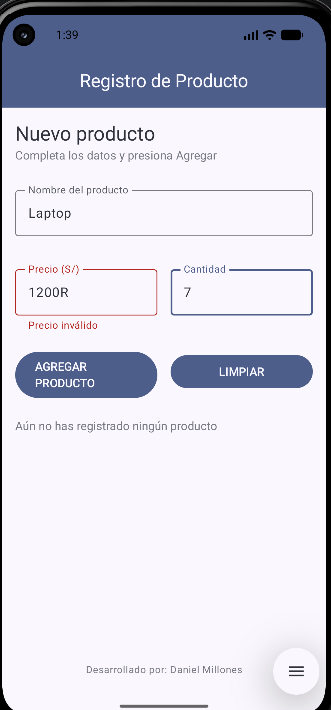
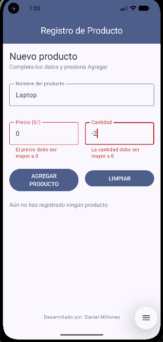
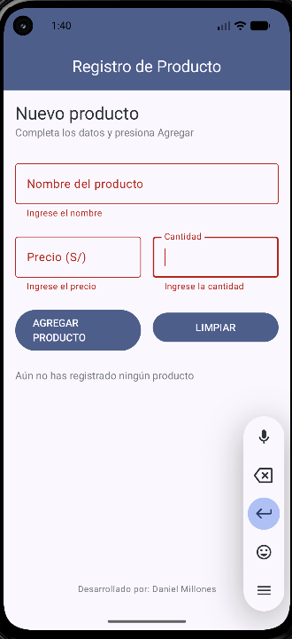

# Lab03 - Registro de Producto

**Autor:** Daniel Millones

## Descripción

Aplicación Android desarrollada en Jetpack Compose que permite registrar un producto
ingresando su nombre, precio y cantidad. Al presionar "AGREGAR PRODUCTO", la app calcula
el importe total (precio × cantidad) y muestra un resumen en una Card, junto con un mensaje
de confirmación. Si algún campo no es numérico, la app no se cae gracias al uso de
`toDoubleOrNull()` / `toIntOrNull()` con el operador Elvis (`?:`).

## Capturas de pantalla

### Pantalla inicial (sin productos registrados)


### Pantalla con producto registrado


### Verificación manual de casos límite
| Prueba 1 | Prueba 2 |
|---|---|
|  |  |

| Prueba 3 | Prueba 4 |
|---|---|
|  |  |

## Pregunta: ¿Qué pasaría si las variables de los campos se declaran SIN `remember`?

Si se declaran así:

```kotlin
var nombre by mutableStateOf("")
```

en lugar de:

```kotlin
var nombre by remember { mutableStateOf("") }
```

Al probarlo, el texto escrito en el campo **se pierde cada vez que la función se recompone**
(por ejemplo, al rotar la pantalla, o al presionar el botón "AGREGAR PRODUCTO" y cambiar el
estado `mostrarResumen`). Esto sucede porque `mutableStateOf("")` sin `remember` crea un
**nuevo estado en cada recomposición**, en lugar de conservar el valor anterior.

`remember` le indica a Compose que debe **recordar** ese valor entre recomposiciones dentro
del mismo ciclo de vida del composable, guardándolo en memoria mientras el composable
permanezca en pantalla. Sin él, cada recomposición "olvida" el estado y lo reinicia a su
valor inicial (`""` en este caso), haciendo que la app sea inutilizable para capturar datos
del usuario de forma persistente.

## Mejora con IA

Durante la Parte B del laboratorio (rama `mejora-ia`), utilicé Gemini para agregar validación
de campos y un botón para limpiar el formulario. A continuación se documenta el prompt
principal utilizado y las decisiones tomadas sobre el código generado.

### Prompt principal enviado a Gemini

```
En mi archivo MainActivity.kt de Jetpack Compose, dentro del composable PantallaRegistro, 
tengo un formulario con tres OutlinedTextField (nombre, precio, cantidad), un Button 
"AGREGAR PRODUCTO" que activa mostrarResumen = true, y una Card que muestra el resumen.

Agrega validación específica por campo al presionar "AGREGAR PRODUCTO":
1. Nombre: no puede estar vacío ni contener solo espacios.
2. Precio: no puede estar vacío, y debe ser un número válido (usa toDoubleOrNull() para 
   verificarlo) — si el usuario escribe letras, debe marcarse como error.
3. Cantidad: no puede estar vacía, y debe ser un número entero válido (usa toIntOrNull()).

Cada campo debe mostrar SU PROPIO mensaje de error específico justo debajo de él (usando 
el parámetro isError y supportingText de OutlinedTextField), no un mensaje genérico único. 
Si hay algún error, NO actives mostrarResumen ni muestres la Card.

Agrega también un botón "Limpiar" al lado de "AGREGAR PRODUCTO" que vacíe los tres campos, 
oculte la Card, y limpie todos los errores.

NO cambies el diseño existente (TopAppBar, jerarquía de textos, colores, Card de resumen, 
mensaje verde de confirmación). Mantén el mismo estilo de código (remember/mutableStateOf) 
que ya uso en el resto del archivo.
```

### Tabla de prompts y decisiones

| Prompt que usé | Qué generó Gemini | Qué acepté o corregí (y por qué) |
|---|---|---|
| Prompt principal (citado arriba): validación de nombre, precio y cantidad por campo con isError/supportingText, y botón Limpiar. | Agregó estados `errorNombre`, `errorPrecio`, `errorCantidad` con `remember/mutableStateOf("")`, validó cada campo por separado en el `onClick` de "AGREGAR PRODUCTO", mostró los errores con `isError`/`supportingText` en cada `OutlinedTextField`, y agregó un botón "LIMPIAR" que resetea el formulario completo. | Acepté el código tal cual lo generó Gemini, sin correcciones. La estructura de validación por campo funcionó correctamente desde la primera iteración. |
| "Centra el texto del botón 'AGREGAR PRODUCTO' con textAlign = TextAlign.Center, y agrega validación de números negativos en precio y cantidad con mensajes específicos, usando el mismo patrón isError/supportingText. No cambiar el diseño existente." | Agregó `textAlign = TextAlign.Center` en el `Text` de ambos botones, y extendió la validación de precio/cantidad para verificar `< 0`, mostrando "El precio no puede ser negativo" / "La cantidad no puede ser negativa". | Detecté que la condición `< 0` dejaba pasar el caso "0" como válido (un producto sin precio ni stock), lo cual es un error de lógica de negocio. Por eso pedí un tercer ajuste en lugar de aceptarlo tal cual. |
| "El precio y la cantidad no pueden ser 0, es un error de lógica de negocio. Ajusta la validación para que ambos deban ser estrictamente mayores a 0, mostrando 'El precio debe ser mayor a 0' / 'La cantidad debe ser mayor a 0'." | Cambió las condiciones de `< 0` a `<= 0` en ambos campos, actualizando los mensajes de error correspondientes. | Corregí verificando manualmente los casos "0", "-1", vacío y letras en precio y cantidad, confirmando que cada uno mostrara el mensaje correcto y que `mostrarResumen` no se activara en ningún caso inválido. |