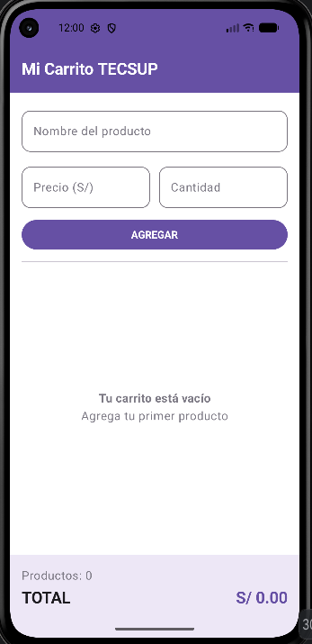
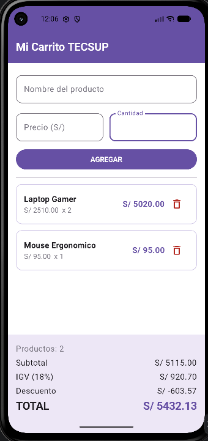
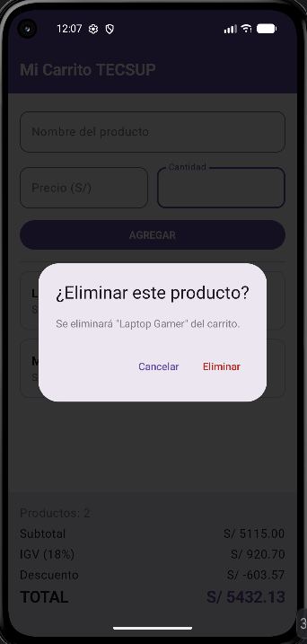

# Mi Carrito TECSUP — Lab 04

**Nombre:** Daniel Millones

Aplicación Android desarrollada en Kotlin con Jetpack Compose para el Laboratorio 4 del curso de Programación Móvil. Permite registrar productos con nombre, precio y cantidad, visualizarlos en una lista, eliminarlos individualmente y ver el cálculo automático de subtotal, IGV (18%), descuento y total.

## Capturas

| Carrito vacío                   | Carrito con productos | Confirmación de borrado |
|---------------------------------|---|---|
|  |  |  |

## Funcionalidades

- Formulario para registrar productos (nombre, precio, cantidad).
- Lista de productos agregados usando `LazyColumn`.
- Eliminación individual de productos mediante el patrón de elevar eventos (`onEliminar`).
- Cálculo automático de subtotal, IGV (18%) y total.
- Estado vacío con mensaje cuando no hay productos registrados.

## Retos opcionales implementados

- **Confirmación de borrado (+1 punto):** al presionar el ícono de eliminar, se muestra un `AlertDialog` con las opciones "Cancelar" y "Eliminar" antes de quitar el producto de la lista.
- **Descuento por monto total (+1 punto):** se aplica automáticamente un descuento del 5% cuando el total supera S/ 3000, y del 10% cuando supera S/ 5000. La fila de descuento solo aparece en el panel de totales cuando corresponde.

## Preguntas conceptuales

**¿Por qué se usa `mutableStateListOf` y no una `MutableList` normal?**

`mutableStateListOf` crea una lista observable por Compose (`SnapshotStateList`). Cuando se le agrega o elimina un elemento, Compose detecta el cambio automáticamente y vuelve a dibujar (recompone) los composables que dependen de esa lista, como la `LazyColumn` y el panel de totales. Una `MutableList` común no está conectada al sistema de estados de Compose, así que sus cambios no disparan recomposición y la interfaz no se actualizaría sola.

**¿Por qué la lista se declara con `val` y aún así se le pueden agregar elementos?**

`val` hace inmutable la referencia, no el contenido del objeto al que apunta. La variable `productos` siempre apunta al mismo `SnapshotStateList`; funciones como `add()` y `remove()` modifican lo que hay dentro de ese objeto sin necesidad de reasignar la variable a una nueva lista. Se necesitaría `var` solo si en algún momento se quisiera hacer que `productos` apunte a una lista completamente distinta.

**¿Qué hace `weight(1f)` en la `LazyColumn`?**

Dentro de una `Column`, `weight(1f)` hace que ese elemento ocupe todo el espacio vertical disponible que sobra después de medir los demás elementos con tamaño fijo (formulario, botón, panel de totales). Así, la lista de productos crece o se reduce según la pantalla y se puede desplazar, mientras el panel de totales queda siempre visible y pegado a la parte inferior.