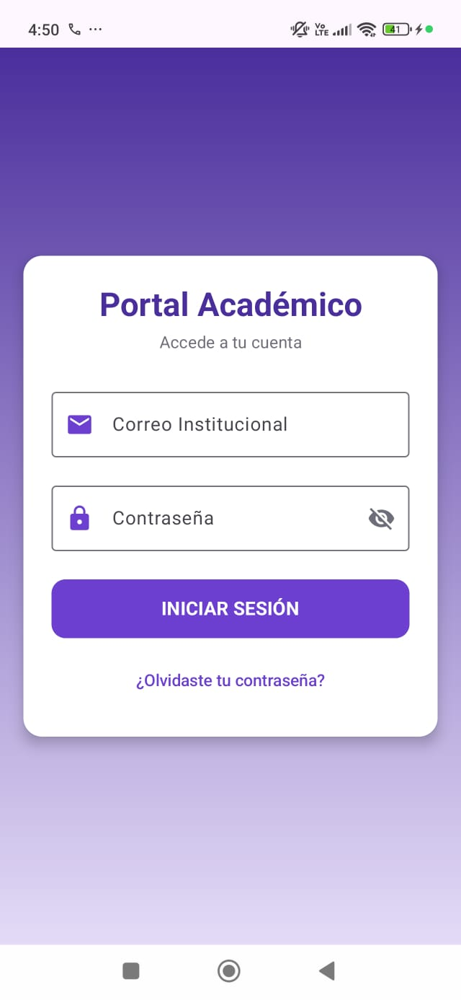
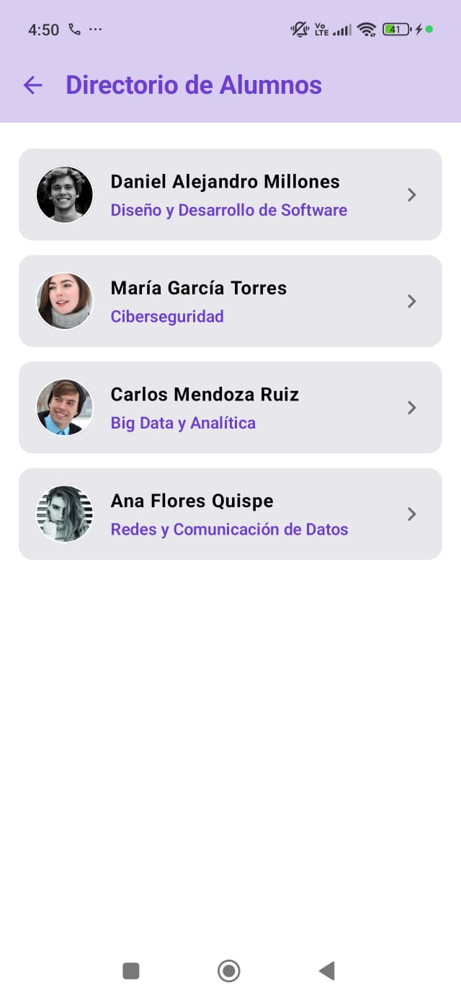
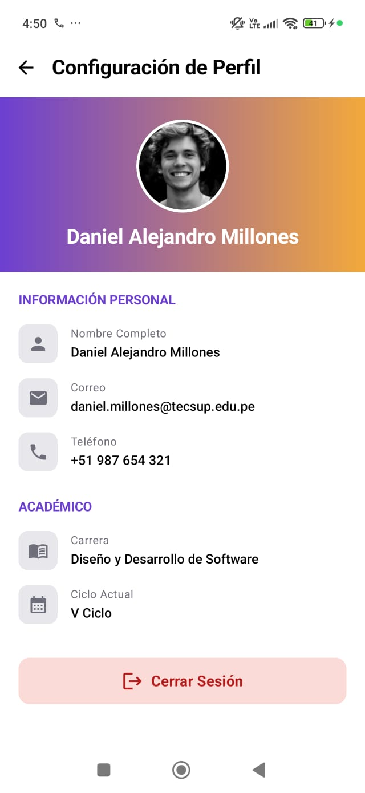

# NavLab — Portal Académico

Proyecto Android desarrollado en **Kotlin** con **Jetpack Compose**, que implementa navegación entre pantallas usando **Navigation Compose** con una `sealed class Screen` como contrato central de rutas.

- **Paquete:** `com.millones.navlab`
- **Lenguaje:** Kotlin
- **Minimum SDK:** API 24
- **Build configuration:** Kotlin DSL

## Tecnologías

- Jetpack Compose (Material 3)
- Navigation Compose
- Coil (carga de imágenes de avatar)

## Flujo de la aplicación

```
LoginScreen
    │
    ▼
BienvenidaScreen
    ├── DirectorioAlumnosScreen
    │       └── ExpedienteAcademicoScreen
    └── ConfiguracionPerfilScreen
```

## Arquitectura

Cada pantalla vive en su propio archivo dentro de `screens/`, como un `@Composable` independiente que recibe `NavController` (y parámetros como `studentId` cuando corresponde). La navegación se centraliza en:

- `navigation/Screen.kt` — sealed class con las rutas: `Login`, `Bienvenida`, `DirectorioAlumnos`, `ExpedienteAcademico` (con argumento `studentId`), `ConfiguracionPerfil`
- `navigation/AppNavigation.kt` — `NavHost` que conecta cada ruta con su pantalla

---

## Prompt de diseño utilizado

El siguiente prompt fue usado para generar el rediseño de la app como "Portal Académico":

```
CONTEXTO
Tengo un proyecto Android en Kotlin/Jetpack Compose llamado NavLab (paquete
com.millones.navlab), ya con navegación funcionando: Screen.kt (sealed class
con rutas) y AppNavigation.kt (NavHost). Esto es una REFACTORIZACIÓN de
nombres sobre lo existente, no una adición en paralelo (ver sección final).

OBJETIVO
Rediseñar/ampliar la app como un "Portal Académico" con las pantallas y
diseño descritos abajo.

CUENTAS DE PRUEBA (MOCK) PARA LOGIN
Lista fija de usuarios de prueba (data class Usuario con email, password,
nombreCompleto, carrera, facultad, telefono, ciclo, id). El id debe tener
formato "2026-0001" (año-número correlativo de 4 dígitos), ej: "2026-0001",
"2026-0002". Al presionar "INICIAR SESIÓN", validar contra esa lista: si
coinciden, navegar a BienvenidaScreen pasando el usuario autenticado; si
no, mostrar un texto de error en rojo debajo del botón ("Correo o
contraseña incorrectos"), sin navegar. Incluir al menos 2 usuarios mock.

IMÁGENES DE AVATAR — OBLIGATORIO
Usar la librería Coil para cargar imágenes reales de avatar desde
https://i.pravatar.cc/150?img=N (una URL distinta por cada alumno/usuario
mock) en DirectorioAlumnosScreen, ExpedienteAcademicoScreen y
ConfiguracionPerfilScreen. NO usar un círculo de color sólido como
resultado final.

PALETA DE COLORES
- Morado oscuro: #4A2E9C
- Morado medio (botones, títulos, íconos): #6C3FD1
- Lavanda claro (fondo de Login/Bienvenida): #E4DBF7
- Morado clarito (fondo de TopAppBar en Directorio): #D8CCF0
- Blanco: #FFFFFF
- Plomo claro (fondo de cards y cajas de íconos, sin bordes): #E8E8EC
- Gris texto secundario: #6E6E7A
- Rojo claro (fondo botón Cerrar Sesión): #FADBD8
- Rojo oscuro (texto botón Cerrar Sesión): #B71C1C
- Naranja (extremo del degradado en Configuración de Perfil): #F2A93B
NOTA: el degradado de ConfiguracionPerfilScreen es DISTINTO al de las
demás pantallas: es HORIZONTAL (Brush.horizontalGradient), de morado
(izquierda, cercano a #6C3FD1) hacia naranja (derecha, #F2A93B), sin
pasar por un tono pastel/claro. Las demás pantallas (Login, Bienvenida,
Expediente) usan degradado VERTICAL morado→lavanda.

TIPOGRAFÍA
- Títulos sobre fondo morado (Login/Bienvenida): headlineMedium, bold,
  blanco
- Título de TopAppBar en Directorio de Alumnos: bold, color MORADO
  (fondo del TopAppBar morado clarito #D8CCF0)
- Títulos de TopAppBar en Expediente y Configuración: fondo blanco,
  texto NEGRO, bold
- Nombre del alumno en Expediente: grande, bold, NEGRO; facultad debajo
  en morado
- "INFORMACIÓN PERSONAL" y "ACADÉMICO" en Configuración: bold,
  mayúsculas, color MORADO
- Texto de datos (Expediente y Configuración): bodyMedium, NEGRO

ICONOS (Material Icons / AutoMirrored donde aplique)
- Correo: Icons.Filled.Email · Contraseña: Icons.Filled.Lock
- Volver: Icons.AutoMirrored.Filled.ArrowBack
- Directorio: Icons.Filled.Group · Perfil: Icons.Filled.Person
- Cerrar sesión: Icons.AutoMirrored.Filled.Logout
- ID Estudiante: Icons.Filled.Badge · Facultad: Icons.Filled.School
- Teléfono: Icons.Filled.Phone · Carrera: Icons.Filled.MenuBook
- Ciclo: Icons.Filled.CalendarMonth
- Flecha en lista: Icons.AutoMirrored.Filled.KeyboardArrowRight
- En Expediente Académico, íconos en morado medio
- En Configuración de Perfil, cada ícono va dentro de una caja pequeña
  SIN borde, solo fondo plomo claro (#E8E8EC) y esquinas redondeadas;
  el ícono en sí es color plomo/gris

FLUJO Y DISTRIBUCIÓN POR PANTALLA

1. LoginScreen (fondo: gradiente vertical morado→lavanda de pantalla
   completa)
   - Card blanca centrada verticalmente, esquinas redondeadas (~16dp),
     con sombra suave
   - Dentro de la card, CENTRADOS horizontalmente: título "Portal
     Académico" (bold, morado oscuro) y subtítulo "Accede a tu cuenta"
     (gris)
   - Campo "Correo Institucional" con ícono Email; campo "Contraseña"
     con ícono Lock y ojo para mostrar/ocultar
   - Botón "INICIAR SESIÓN" ancho completo, fondo morado medio, texto
     blanco
   - Debajo del botón, TextButton centrado "¿Olvidaste tu contraseña?"
     en morado
   - Validar contra la lista de usuarios mock

2. BienvenidaScreen (fondo: gradiente vertical morado→lavanda de
   pantalla completa)
   - Todo el bloque de texto centrado (textAlign = Center)
   - "Bienvenido, [nombreCompleto del usuario logueado]" en blanco, bold,
     headlineMedium
   - Spacer(modifier = Modifier.height(16.dp)) antes de la siguiente línea
   - Subtítulo "¿Qué deseas gestionar hoy?" en blanco/lavanda claro,
     centrado
   - Dos cards blancas apiladas, cada una con ícono en círculo lavanda +
     título bold + descripción gris:
     a) "Directorio de Alumnos" — "Ver y gestionar estudiantes"
     b) "Mi Perfil Académico" — "Datos personales y progreso"
   - Al fondo: texto/botón rojo con ícono de logout "Cerrar Sesión
     Segura", centrado
   - (a) → DirectorioAlumnosScreen · (b) → ConfiguracionPerfilScreen
   - "Cerrar Sesión Segura" → LoginScreen con
     popUpTo(Screen.Login.route) { inclusive = true }

3. DirectorioAlumnosScreen
   - Fondo de toda la pantalla (detrás de las cards): BLANCO (#FFFFFF)
   - TopAppBar: fondo morado clarito (#D8CCF0), título "Directorio de
     Alumnos" en color MORADO bold, y navigationIcon con
     Icons.AutoMirrored.Filled.ArrowBack (navController.popBackStack())
   - Cada alumno dentro de un Card SIN borde, solo fondo plomo claro
     (#E8E8EC), esquinas redondeadas; avatar (imagen Coil) circular,
     nombre bold negro, carrera en morado, flecha a la derecha
   - Al tocar un alumno → ExpedienteAcademicoScreen pasando su id

4. ExpedienteAcademicoScreen
   - TopAppBar con ArrowBack + título "Expediente Académico", fondo
     blanco, texto NEGRO
   - Debajo: sección con gradiente VERTICAL morado→lavanda, con las
     esquinas INFERIORES redondeadas (Modifier.clip(RoundedCornerShape(
     bottomStart = 24.dp, bottomEnd = 24.dp))); avatar (imagen Coil)
     circular con borde blanco centrado justo sobre esa línea/borde
     inferior, solapando el límite entre el degradado y el contenido
     de abajo
   - Debajo: nombre grande, bold, NEGRO; facultad en morado
   - Una única Card SIN borde, solo fondo plomo claro (#E8E8EC), que
     agrupa ID Estudiante (formato "2026-0001"), Correo Electrónico y
     Facultad (ícono morado + label gris + valor negro), luego
     HorizontalDivider, y debajo "Biografía" (título bold negro +
     párrafo negro), todo en la misma card

5. ConfiguracionPerfilScreen
   - TopAppBar con ArrowBack + título "Configuración de Perfil", fondo
     blanco, texto NEGRO
   - Debajo: sección con degradado HORIZONTAL morado→naranja (ver
     Paleta), avatar (imagen Coil) circular con borde blanco centrado,
     y el nombre completo del usuario debajo del avatar, dentro de esa
     misma sección
   - Debajo, SIN card contenedora: título "INFORMACIÓN PERSONAL" (bold,
     morado) seguido de las filas Nombre Completo, Correo, Teléfono —
     cada fila con su ícono dentro de una cajita sin borde (fondo plomo
     claro), label gris arriba y valor negro abajo
   - Debajo, título "ACADÉMICO" (bold, morado) seguido de las filas
     Carrera y Ciclo Actual (sin Ciudad), mismo estilo de fila
   - Al final, botón "Cerrar Sesión" ancho completo: fondo rojo claro
     (#FADBD8), texto rojo oscuro (#B71C1C), ícono de logout, esquinas
     redondeadas

ARQUITECTURA TÉCNICA (obligatorio)
- Cada pantalla en su propio archivo .kt dentro de screens/, como
  @Composable independiente y reutilizable
- Usar Scaffold en cada pantalla
- Extraer elementos repetidos en Composables reutilizables:
  GradientBackground (parametrizable en colores/dirección para el caso
  horizontal morado→naranja de Configuración vs. vertical en las demás),
  GradientHeaderWithAvatar (con esquinas inferiores redondeadas
  opcionales), InfoRow (ícono+label+valor, con variante "ícono en caja
  plomo sin borde" para Configuración), OptionCard (para BienvenidaScreen)
- Actualizar AppNavigation.kt con los composable(...) de las nuevas rutas
- No agregar comentarios en el código generado

NOTA SOBRE REFACTORIZACIÓN (aplica sobre lo ya existente, no en paralelo)
- Screen.Home → Screen.Bienvenida (route "bienvenida")
- Screen.List → Screen.DirectorioAlumnos (route "directorio")
- Screen.Profile → Screen.ConfiguracionPerfil (route "configuracion")
- Screen.Detail → Screen.ExpedienteAcademico (route "expediente/{studentId}"),
  createRoute(studentId) reemplaza createRoute(itemId)
- Se agrega Screen.Login (route "login") como NUEVO startDestination
Renombra también los archivos y funciones Composable correspondientes,
actualizando todos los imports y llamadas en AppNavigation.kt.

RESTRICCIONES
- Mantener el paquete com.millones.navlab en todos los imports
```

---

## Resultados

### 1. LoginScreen

### 2. BienvenidaScreen

### 3. DirectorioAlumnosScreen

### 4. ExpedienteAcademicoScreen

### 5. ConfiguracionPerfilScreen



