# Clínica SaludPlus — App Paciente

Aplicación móvil Android para el agendamiento y gestión de citas médicas orientada a pacientes. La aplicación no utiliza base de datos ni se conecta a un sistema externo: los usuarios, especialidades, médicos y citas viven en colecciones en memoria dentro del objeto `Repositorio` y se pierden al cerrar la app (comportamiento intencional). Este repositorio es la solución de referencia del docente para los estudiantes.

## 1. Título y descripción

**Clínica SaludPlus — App Paciente** es una aplicación desarrollada en Kotlin con Jetpack Compose para facilitar la reserva y administración de citas médicas. Toda la información de la aplicación se gestiona en memoria sin persistencia local ni remota.

## 2. Objetivos

- Completar una app real de agendamiento de citas médicas a partir de un código esqueleto.
- Implementar `NavigationBar` como menú principal de navegación en la pantalla de Inicio (Inicio, Citas, Resultados, Perfil).
- Aplicar `LazyRow` (especialidades destacadas), `LazyColumn` (especialidades, médicos y citas) y `LazyVerticalGrid` (horarios) trabajando con colecciones en memoria.
- Aplicar navegación con paso de parámetros (`especialidadId`, `medicoId`, `fecha`, `hora`) y `popUpTo`.
- Diseñar las vistas requeridas respetando el estilo visual del proyecto.
- Aplicar control de versiones con GitHub en dos fases: desarrollo propio y mejora asistida por IA.

## 3. Tecnologías

- **Lenguaje:** Kotlin
- **UI:** Jetpack Compose, Material 3
- **Navegación:** Navigation Compose 2.8.5
- **Carga de imágenes:** Coil 2.7.0 (fotos de médicos desde `randomuser.me`, requiere internet)
- **Íconos:** `material-icons-extended`
- **Paquete principal:** `com.saludplus.citas`

## 4. Cómo ejecutar

1. Clonar el repositorio:
   ```bash
   git clone https://github.com/DMillonnesZ/Moviles-Seccion-D.git
   ```
2. Cambiar a la rama de la Fase 1:
   ```bash
   git checkout sin-ia
   ```
3. Abrir en Android Studio la carpeta del proyecto que está dentro de `Semana 6` (`File > Open`).
4. Esperar el Sync de Gradle y ejecutar en un emulador o celular con internet.
5. Como los datos viven en memoria, hay que registrarse cada vez que se abre la app desde cero.

## 5. Estructura del proyecto

```text
com.saludplus.citas
├── MainActivity.kt
├── data
│   ├── model
│   │   ├── Usuario.kt
│   │   ├── Especialidad.kt
│   │   ├── Medico.kt
│   │   ├── Cita.kt
│   │   └── Resultado.kt
│   └── repository
│       └── Repositorio.kt
├── navigation
│   ├── Rutas.kt
│   └── AppNavigation.kt
└── ui
    ├── theme
    ├── components
    │   ├── BotonAzul.kt
    │   ├── EnlaceTexto.kt
    │   ├── BarraSuperior.kt
    │   ├── BarraNavegacion.kt
    │   ├── CampoTextoIcono.kt
    │   ├── TarjetaSuave.kt
    │   ├── AvatarMedico.kt
    │   ├── FilaDetalle.kt
    │   └── EstiloEspecialidad.kt
    └── screens
        ├── auth
        │   ├── SplashScreen.kt
        │   ├── RegistroScreen.kt
        │   ├── LoginScreen.kt
        │   └── TerminosScreen.kt
        ├── home
        │   └── HomeScreen.kt
        ├── agendamiento
        │   ├── EspecialidadesScreen.kt
        │   ├── MedicosScreen.kt
        │   ├── FechaHoraScreen.kt
        │   ├── ConfirmarCitaScreen.kt
        │   └── CitaExitosaScreen.kt
        ├── citas
        │   ├── MisCitasScreen.kt
        │   └── DetalleCitaScreen.kt
        ├── perfil
        │   └── PerfilScreen.kt
        ├── resultados
        │   └── ResultadosScreen.kt
        └── notificaciones
            └── NotificacionesScreen.kt
```

## 6. Pantallas y capturas

### Pantallas obligatorias

1. **Splash:** Imagen, columnas y botones. Practica `Image`, `Column` y botones.
2. **Registro:** Estados, campos con validación (nombre, teléfono de 9 dígitos, correo, contraseña de 6 caracteres), casilla de aceptación de Términos que habilita "Registrarme", y `add` a la lista de usuarios.
3. **Login:** Búsqueda con `find` y gestión de sesión.
4. **Inicio:** Layout con `Scaffold`, `NavigationBar`, accesos rápidos y `LazyRow` de especialidades destacadas.
5. **Especialidades:** `LazyColumn` y búsqueda en tiempo real con `filter`.
6. **Médicos:** Recibe parámetro `especialidadId`, aplica `filter` + `sortedByDescending`, e incluye buscador con lupa.
7. **Fecha y hora:** `LazyVerticalGrid`, selección de día y muestra de horarios disponibles.
8. **Confirmar cita:** Recibe parámetros `medicoId`, `fecha` y `hora`; guarda la cita (`any` + `add`).
9. **Cita agendada:** Resumen de la cita y limpieza del historial con `popUpTo`.
10. **Mis citas:** `LazyColumn` y mensaje de lista vacía.
11. **Perfil:** Datos de sesión y opción de cerrar sesión.

### Retos extra

12. **Detalle de cita:** Diálogo de confirmación `AlertDialog` y eliminación de la cita con `removeIf`.
13. **Resultados:** Modelo de datos propio `Resultado` y lista fija.
14. **Notificaciones:** Generación de notificaciones aplicando `map` sobre las citas del usuario.
15. **Términos y condiciones:** Texto legal con scroll basado en la Ley 29733, su Reglamento (D.S. 016-2024-JUS), la Ley General de Salud, la Ley 29414 y la Ley 30024. Es un texto de ejemplo con fines educativos, no asesoría legal.

### Capturas

| Pantalla | Captura |
|---|---|
| Splash | 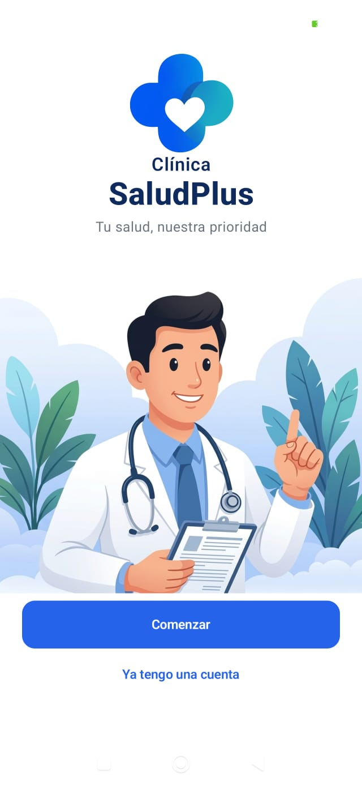 |
| Registro | 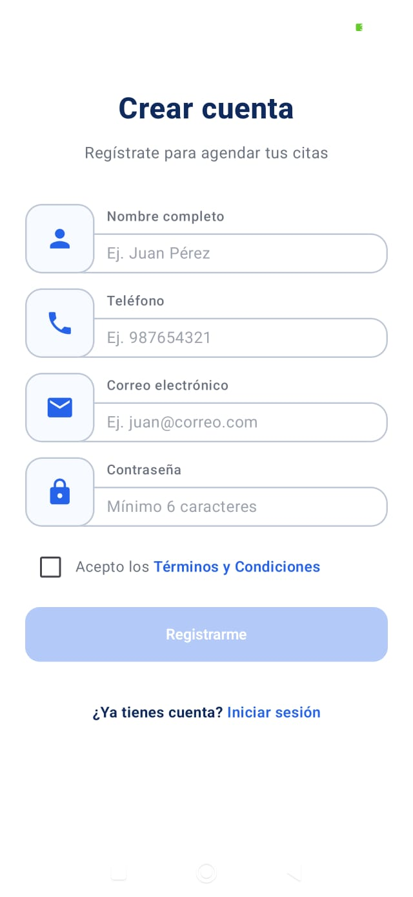 |
| Términos | 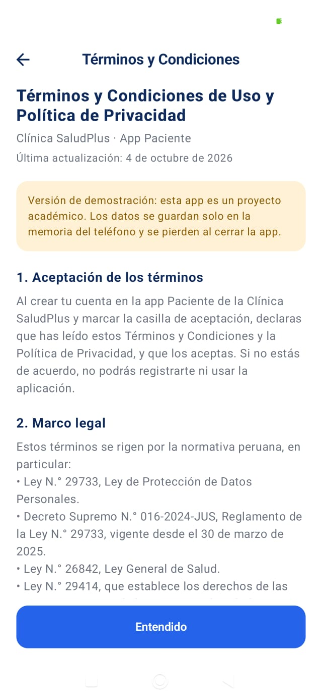 |
| Login | 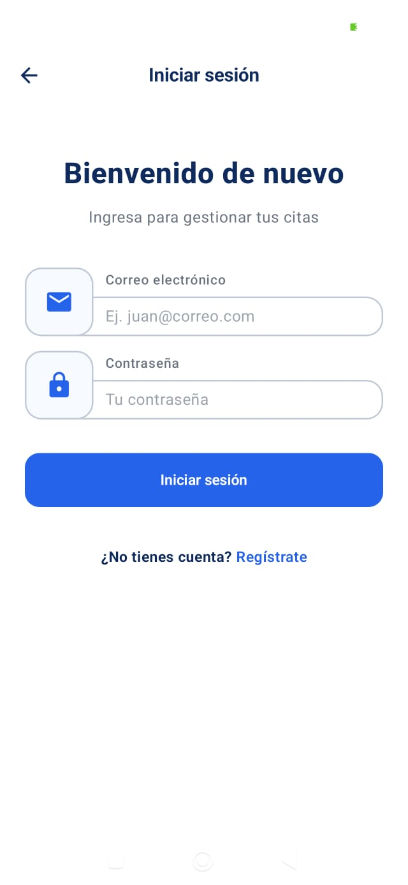 |
| Inicio | 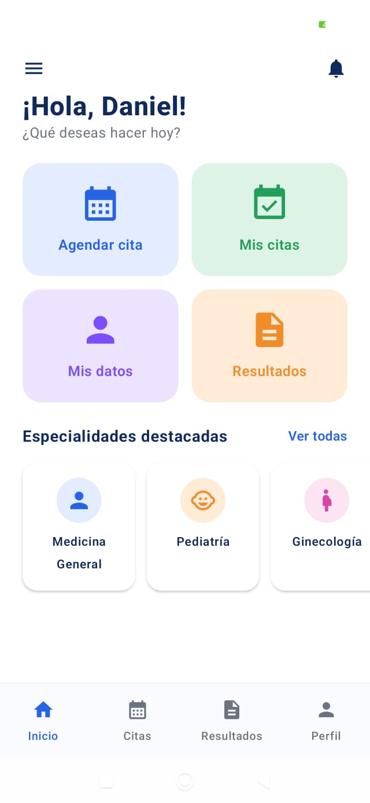 |
| Especialidades | 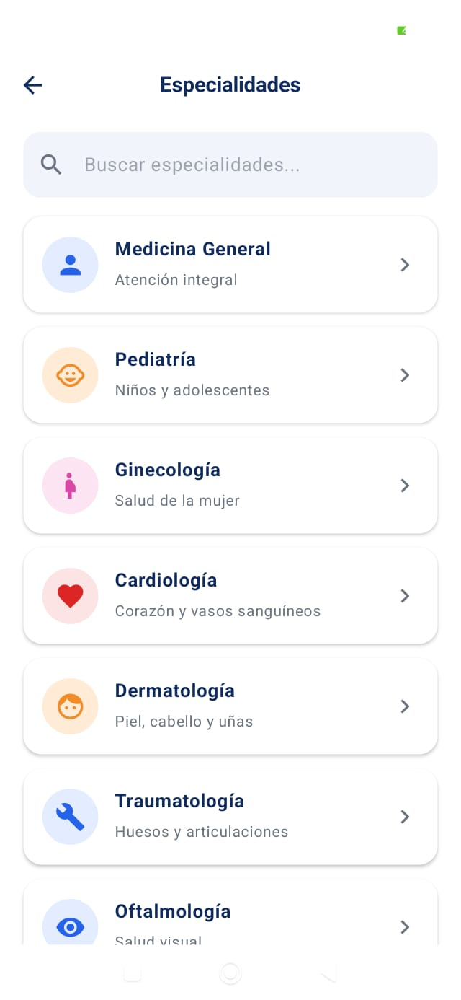 |
| Médicos | 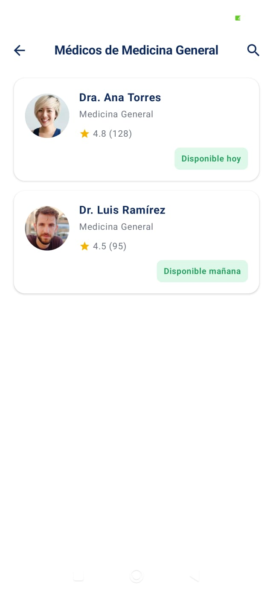 |
| Fecha y hora | 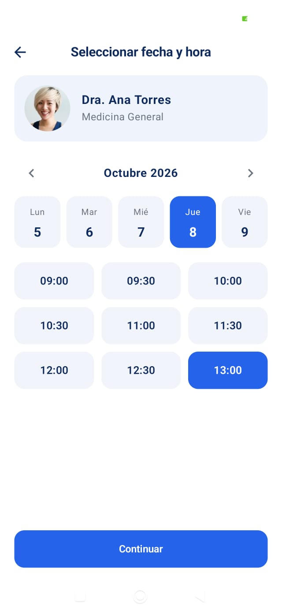 |
| Confirmar cita | 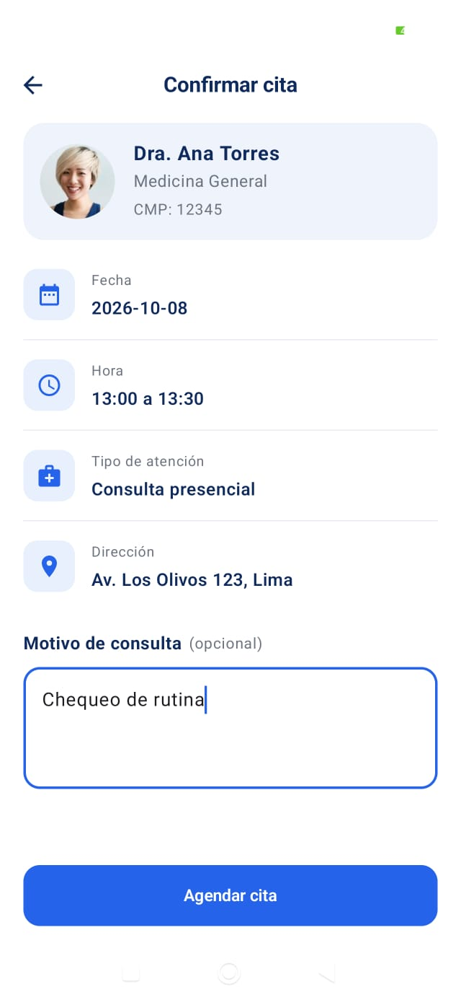 |
| Cita agendada | 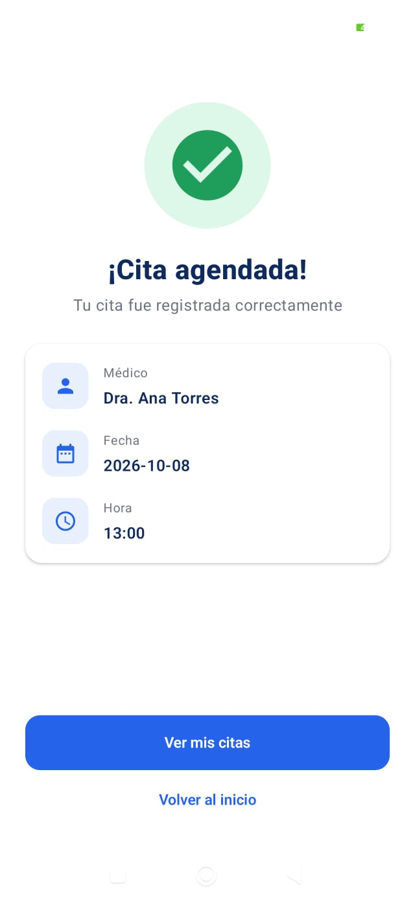 |
| Mis citas | 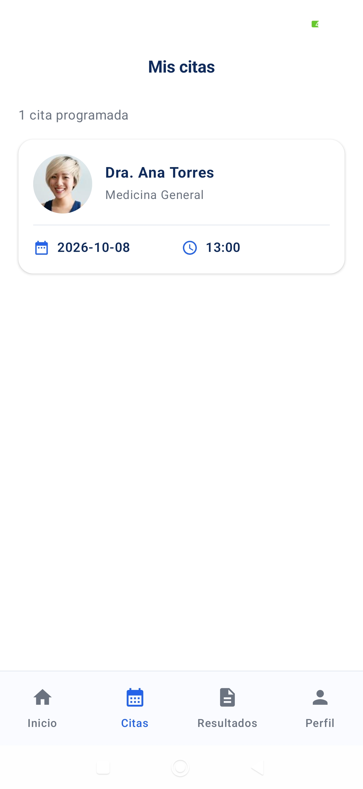 |
| Mis citas vacíos | 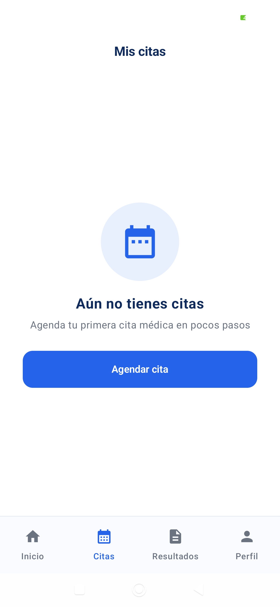 |
| Detalle de cita | 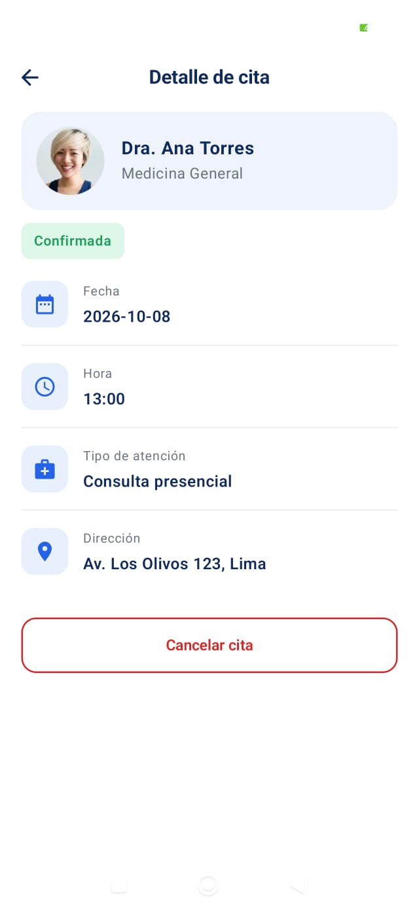 |
| Perfil | 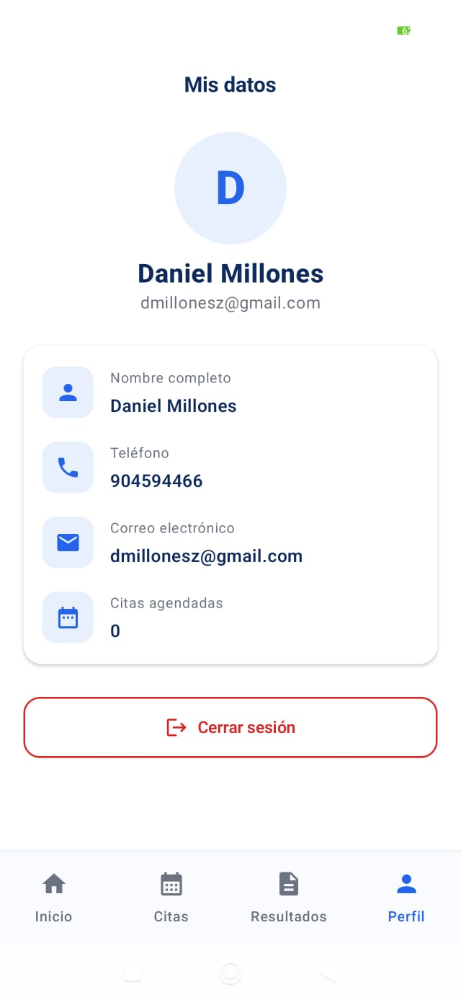 |
| Resultados | 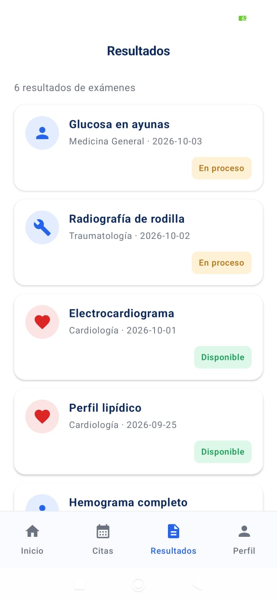 |
| Notificaciones | 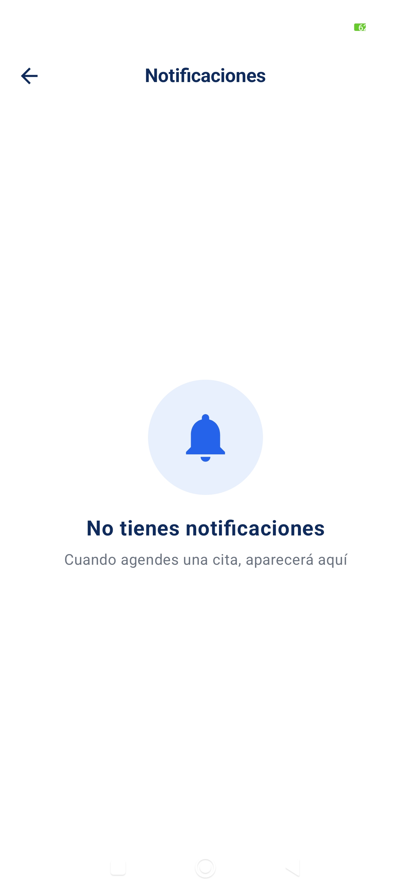 |

## 7. Flujo de navegación

```text
Splash → Registro o Login → Inicio → Especialidades → Médicos(especialidadId) → FechaHora(medicoId) → ConfirmarCita(medicoId, fecha, hora) → Cita agendada → Mis citas
```

- Al confirmar, `popUpTo(HOME)` borra el flujo de agendamiento del historial.
- `Mis citas` → `Detalle(citaId)`.
- `Perfil` → `Splash` al cerrar sesión.
- Campana de `Inicio` → `Notificaciones`.
- Enlace del `Registro` → `Términos`.
- `NavigationBar` con 4 destinos: Inicio, Citas, Resultados, Perfil.

## 8. Funciones del Repositorio

- `registrarUsuario`: Comprueba duplicado con `any` y agrega con `add`.
- `iniciarSesion` y `cerrarSesion`: Búsqueda con `find` y actualización de `usuarioActual`.
- `buscarEspecialidades`: Filtrado con `filter` + `contains`.
- `especialidadesDestacadas`: Retorna los primeros elementos con `take(5)`.
- `obtenerEspecialidad`, `obtenerMedico`, `obtenerCita`: Búsqueda por id con `find`.
- `medicosPorEspecialidad` y `buscarMedicos`: Filtrado con `filter` y ordenamiento por calificación con `sortedByDescending`.
- `horariosDisponibles`: Filtrado con `filter` + `map`; oculta las horas ya reservadas por médico y fecha.
- `agendarCita`: Comprobación con `any` y guardado con `add`.
- `citasDelUsuario`: Filtrado con `filter` y ordenamiento con `sortedWith`.
- `cancelarCita`: Eliminación de cita con `removeIf`.

## 9. Pruebas manuales

| Caso | Pasos | Resultado esperado | Estado |
|---|---|---|---|
| 1 | Registro con campos vacíos | Muestra los 4 errores en pantalla | Pendiente |
| 2 | Teléfono solo de 9 dígitos | Intenta ingresar teléfono distinto de 9 dígitos | Solo permite exactamente 9 dígitos | Pendiente |
| 3 | Casilla de Términos | Intentar registrarse sin marcar la casilla | El botón "Registrarme" permanece deshabilitado | Pendiente |
| 4 | Conservación de datos | Escribir datos en Registro, abrir Términos y volver | Los campos se conservan al volver | Pendiente |
| 5 | Correo repetido | Intentar registrar un correo que ya existe | Muestra "Este correo ya está registrado" | Pendiente |
| 6 | Validaciones de Login | Probar credenciales incorrectas y correctas | Muestra error con incorrectas; entra a Inicio con correctas | Pendiente |
| 7 | Atrás en Inicio | Presionar el botón Atrás desde la pantalla de Inicio | Cierra la aplicación | Pendiente |
| 8 | Búsqueda en Especialidades | Buscar "car" y buscar "zzz" | "car" muestra Cardiología; "zzz" muestra mensaje de lista vacía | Pendiente |
| 9 | Ordenamiento de Médicos | Abrir el listado de médicos de una especialidad | Aparecen ordenados de mayor a menor calificación | Pendiente |
| 10 | Selección de día y hora | Elegir día y cambiar de día en Fecha y hora | "Continuar" solo se habilita con día y hora elegidos; cambiar día reinicia la hora | Pendiente |
| 11 | Bloqueo de horario reservado | Reservar un horario y revisar disponibilidad | El horario reservado no aparece para ese médico y fecha, pero sigue libre con otro médico | Pendiente |
| 12 | Navegación tras confirmar | Confirmar cita y presionar Atrás desde Cita agendada | No regresa al flujo de agendamiento | Pendiente |
| 13 | Mis citas | Entrar a Mis citas sin citas y con citas | Muestra mensaje y botón "Agendar cita" si no hay citas; con citas las ordena por fecha y hora | Pendiente |
| 14 | Cancelación de cita | Cancelar una cita desde Detalle de cita aceptando el AlertDialog | Elimina la cita y libera el horario | Pendiente |
| 15 | Cierre de sesión | Presionar "Cerrar sesión" en Perfil y presionar Atrás | Lleva a Splash y presionar Atrás cierra la app | Pendiente |
| 16 | Citas por usuario | Iniciar sesión con usuarios distintos | Cada usuario ve únicamente sus propias citas y notificaciones | Pendiente |

## 10. Limitaciones y decisiones de diseño

- **Fecha y hora fija:** Usa una lista fija de 5 días hábiles (lunes 5 a viernes 9 de octubre de 2026); las flechas del mes no realizan acciones y la fecha se muestra como `2026-10-06`. Se resuelve en la Fase 2 (rama `mejora-ia`) con `java.time.LocalDate`.
- **Datos en memoria:** Los datos se pierden al cerrar la app.
- **Conexión a internet para fotos:** Las fotos de los médicos necesitan internet; sin conexión se muestran las iniciales.
- **Valores de ejemplo:** El código CMP y la dirección de la clínica en Confirmar cita son valores de ejemplo.
- **Motivo de consulta:** El motivo de consulta se escribe pero no se guarda en el modelo.
- **Pruebas:** No hay pruebas automatizadas; solo se contemplan pruebas manuales.
- **Cumplimiento de reglas:** No se usa base de datos (Room, SQLite, Firebase) ni se cambian nombres ni parámetros de las funciones del Repositorio ni de las pantallas.

## 11. Historial de commits

| Nº | Mensaje |
|---|---|
| 1 | Commit inicial: Esqueleto del proyecto Clínica SaludPlus - App Paciente |
| 2 | Agregar esqueleto: paquetes data, navigation y ui con pantallas en construcción |
| 3 | Crear modelos de datos: Usuario, Especialidad, Medico y Cita |
| 4 | Implementar funciones de autenticación en Repositorio (registro, inicio y cierre de sesión) |
| 5 | Implementar búsqueda y filtros de especialidades y médicos en Repositorio |
| 6 | Implementar gestión de citas y horarios en Repositorio |
| 7 | Crear paleta de colores y componentes UI reutilizables |
| 8 | Agregar navegación base, tema de la clínica y pantalla Splash |
| 9 | Completar RegistroScreen con validaciones y conectar desde Splash |
| 10 | Completar LoginScreen con inicio de sesión y flujo de navegación hacia Login |
| 11 | Completar HomeScreen con saludo, accesos rápidos y LazyRow de especialidades destacadas |
| 12 | Agregar NavigationBar con los destinos Inicio, Citas, Resultados y Perfil |
| 13 | Completar EspecialidadesScreen con búsqueda en tiempo real y LazyColumn |
| 14 | Completar MedicosScreen recibiendo especialidadId y ordenando por calificación |
| 15 | Completar FechaHoraScreen con LazyVerticalGrid y horarios disponibles |
| 16 | Completar ConfirmarCitaScreen y CitaExitosaScreen con popUpTo |
| 17 | Completar MisCitasScreen con LazyColumn y mensaje de lista vacía |
| 18 | Completar PerfilScreen con datos de sesión y cierre de sesión |
| 19 | Completar DetalleCitaScreen con AlertDialog y cancelación de cita |
| 20 | Completar ResultadosScreen con modelo Resultado y lista fija |
| 21 | Completar NotificacionesScreen con map sobre las citas del usuario |
| 22 | Completar TerminosScreen con texto legal y agregar casilla de aceptación en el Registro |

## 12. Fase 2 (pendiente)

En la Fase 2 (`mejora-ia`) se abordará la implementación del calendario dinámico con `java.time.LocalDate`:
- Mostrar los próximos 5 días hábiles a partir de hoy (sin sábados, domingos ni días pasados).
- Flechas `<` y `>` para avanzar o retroceder una semana (sin retroceder antes de la semana actual).
- Cambio dinámico del mes y año ("Octubre 2026").
- Recálculo automático de horarios disponibles al cambiar de día e inicialización de la hora seleccionada.
- Formato de fecha en texto en español en la pantalla de Confirmar cita.
- Se requerirá un mínimo de 3 commits descriptivos en la rama `mejora-ia` y la documentación de cada prompt en `PROMPTS.md`.

## 13. Autor

- **Autor:** Daniel Alejandro Millones
- **Curso:** Programación en Móviles (Sección D). Laboratorio 6 complementario, Semana 6.
