# Clínica SaludPlus — App Paciente

Aplicación móvil Android para el agendamiento y gestión de citas médicas orientada a pacientes. La aplicación no utiliza base de datos ni se conecta a un sistema externo: los usuarios, especialidades, médicos y citas viven en colecciones en memoria dentro del objeto `Repositorio` y se pierden al cerrar la app (comportamiento intencional). Este repositorio es la solución de referencia del docente para los estudiantes.

## 1. Título y descripción

**Clínica SaludPlus — App Paciente** es una aplicación desarrollada en Kotlin con Jetpack Compose para facilitar la reserva y administración de citas médicas. Toda la información de la aplicación se gestiona en memoria sin persistencia local ni remota. En la **Fase 2 (`con-ia`)**, la aplicación ha sido completamente rediseñada y mejorada con un calendario dinámico con `java.time.LocalDate`, notificaciones locales con sonido, sistema de mensajes globales, selector desplegable de mes y mejoras de accesibilidad y experiencia de usuario.

## 2. Objetivos

- Completar una app real de agendamiento de citas médicas a partir de un código esqueleto.
- Implementar `NavigationBar` como menú principal de navegación en la pantalla de Inicio (Inicio, Citas, Resultados, Perfil).
- Aplicar `LazyRow` (especialidades destacadas), `LazyColumn` (especialidades, médicos y citas) y `LazyVerticalGrid` (horarios) trabajando con colecciones en memoria.
- Aplicar navegación con paso de parámetros (`especialidadId`, `medicoId`, `fecha`, `hora`) y `popUpTo`.
- Diseñar las vistas requeridas respetando el estilo visual del proyecto.
- Aplicar control de versiones con GitHub en dos fases: desarrollo propio (`sin-ia`) y mejora asistida por IA (`con-ia`).

## 3. Tecnologías

- **Lenguaje:** Kotlin
- **UI:** Jetpack Compose, Material 3
- **Navegación:** Navigation Compose 2.8.5
- **Carga de imágenes:** Coil 2.7.0 (fotos de médicos desde `randomuser.me`, requiere internet)
- **Íconos:** `material-icons-extended`
- **Manejo de Fechas:** `java.time.LocalDate` y `java.time.YearMonth` (minSdk 26)
- **Notificaciones:** `NotificationChannel` con sonido y permiso `POST_NOTIFICATIONS`
- **Paquete principal:** `com.saludplus.citas`

## 4. Cómo ejecutar

1. Clonar el repositorio:
   ```bash
   git clone https://github.com/DMillonnesZ/Moviles-Seccion-D.git
   ```
2. Cambiar a la rama de la Fase 2:
   ```bash
   git checkout con-ia
   ```
3. Abrir en Android Studio la carpeta del proyecto que está dentro de `Semana 6` (`File > Open`).
4. Esperar el Sync de Gradle y ejecutar en un emulador o celular con internet (Android 8.0 / API 26 o superior).
5. Como los datos viven en memoria, hay que registrarse o iniciar sesión cada vez que se abre la app desde cero.

## 5. Estructura del proyecto

```text
com.saludplus.citas
├── MainActivity.kt
├── data
│   ├── model
│   │   ├── Usuario.kt
│   │   ├── Especialidad.kt
│   │   ├── Medico.kt
│   │   ├── Cita.kt
│   │   └── Resultado.kt
│   └── repository
│       └── Repositorio.kt
├── navigation
│   ├── Rutas.kt
│   └── AppNavigation.kt
├── util
│   └── Fechas.kt
└── ui
    ├── theme
    │   ├── Color.kt
    │   ├── Disenio.kt
    │   ├── Theme.kt
    │   └── Type.kt
    ├── components
    │   ├── AvatarMedico.kt
    │   ├── BarraNavegacion.kt
    │   ├── BarraSuperior.kt
    │   ├── BotonAzul.kt
    │   ├── CampoTextoIcono.kt
    │   ├── ComponentesDisenio.kt
    │   ├── EnlaceTexto.kt
    │   ├── EstiloEspecialidad.kt
    │   ├── FilaDetalle.kt
    │   ├── Mensajes.kt
    │   └── TarjetaSuave.kt
    └── screens
        ├── agendamiento
        │   ├── CitaExitosaScreen.kt
        │   ├── ConfirmarCitaScreen.kt
        │   ├── EspecialidadesScreen.kt
        │   ├── FechaHoraScreen.kt
        │   └── MedicosScreen.kt
        ├── auth
        │   ├── LoginScreen.kt
        │   ├── RegistroScreen.kt
        │   ├── SplashScreen.kt
        │   └── TerminosScreen.kt
        ├── citas
        │   ├── DetalleCitaScreen.kt
        │   └── MisCitasScreen.kt
        ├── home
        │   └── HomeScreen.kt
        ├── notificaciones
        │   └── NotificacionesScreen.kt
        ├── perfil
        │   └── PerfilScreen.kt
        └── resultados
            ├── ResultadoDetalleScreen.kt
            └── ResultadosScreen.kt
```

## 6. Pantallas y capturas

### Capturas Fase 1 (`sin-ia`)

| Pantalla | Captura |
|---|---|
| Splash |  |
| Registro |  |
| Términos |  |
| Login |  |
| Inicio |  |
| Especialidades |  |
| Médicos |  |
| Fecha y hora |  |
| Confirmar cita |  |
| Cita agendada |  |
| Mis citas |  |
| Mis citas vacíos |  |
| Detalle de cita |  |
| Perfil |  |
| Resultados |  |
| Notificaciones |  |

### Capturas adicionales de la Fase 2 (`con-ia`)

Secuencia completa de capturas de pantalla para todas las funcionalidades e interacciones integradas en la Fase 2:

| Nº | Funcionalidad / Pantalla | Captura | Descripción |
|---|---|---|---|
| 17 | Selector desplegable de mes | 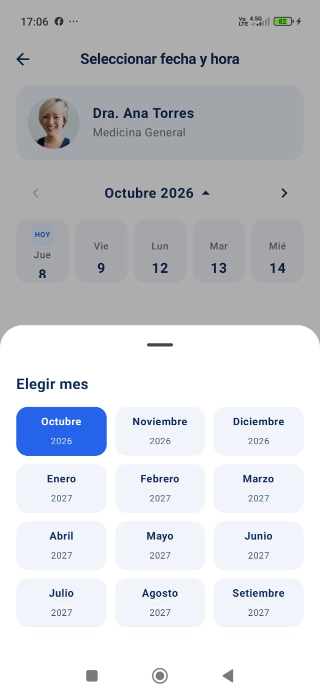 | `ModalBottomSheet` desplegado en FechaHoraScreen con 12 meses futuros |
| 18 | Mensaje de bienvenida dinámico | 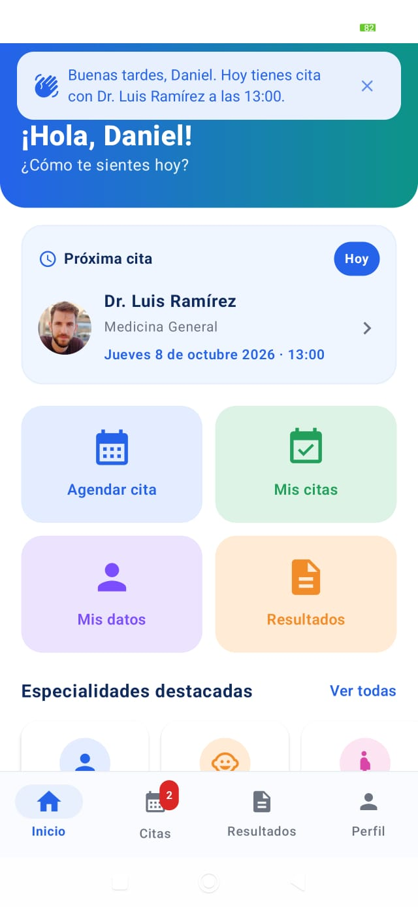 | Banner flotante en Inicio con saludo y recomendación o cita del día |
| 19 | Menú lateral deslizable (Drawer) | 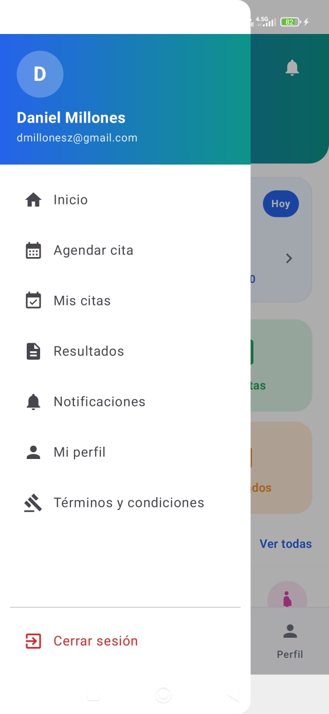 | `ModalNavigationDrawer` abierto con datos del paciente y opciones navegables |
| 20 | Confeti y Ticket de Agendamiento | 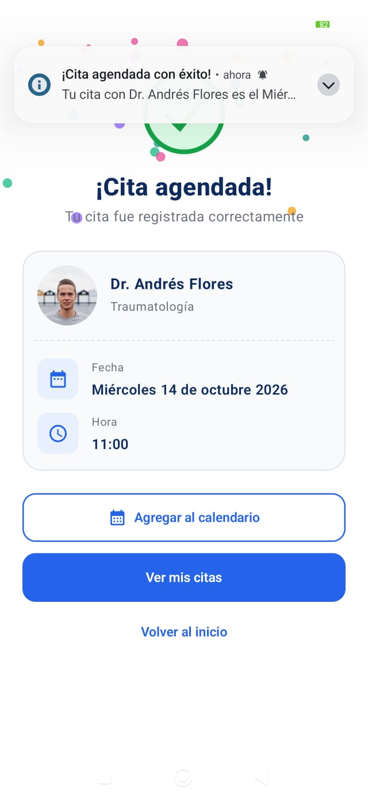 | CitaExitosaScreen con confeti animado Canvas y botón "Agregar al calendario" |
| 21 | Integración con Google Calendar | 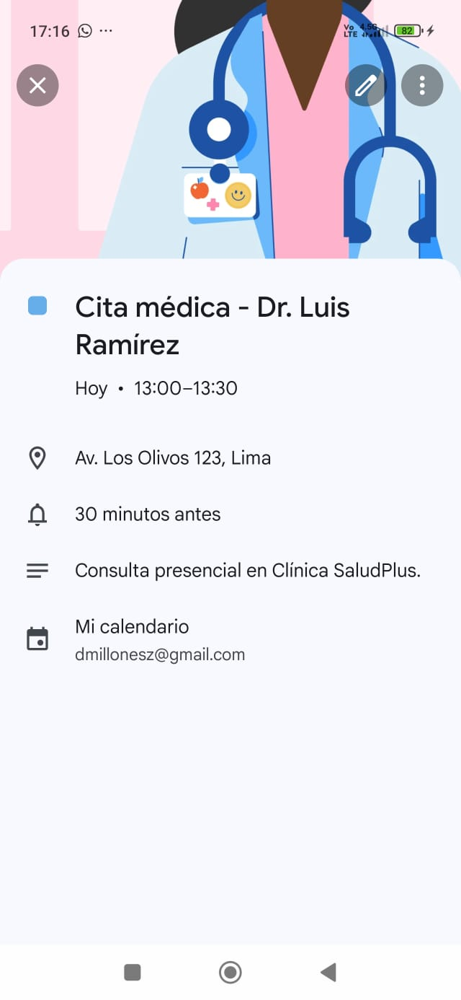 | Lanzamiento de Intent nativo `ACTION_INSERT` de CalendarContract para guardar el evento |
| 22 | Mis Citas — Pestañas Próximas y Pasadas | 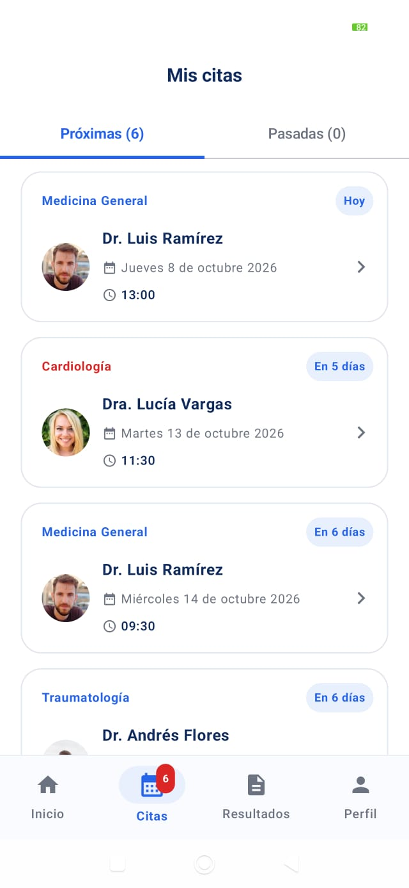 | MisCitasScreen separando atenciones pendientes de historial pasadas |
| 23 | Mis Citas — Deslizar para cancelar | 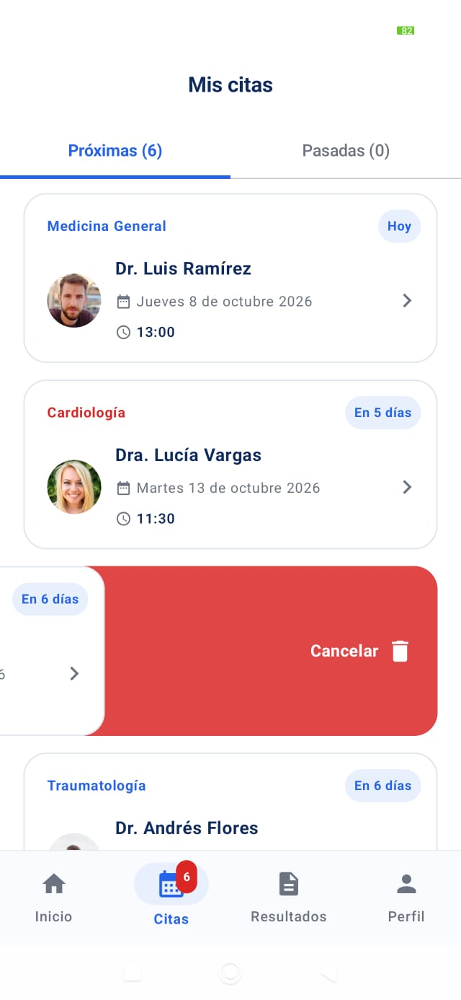 | Acción `SwipeToDismissBox` hacia la izquierda con fondo rojo e ícono de papelera |
| 24 | Detalle de Cita y Cancelación | 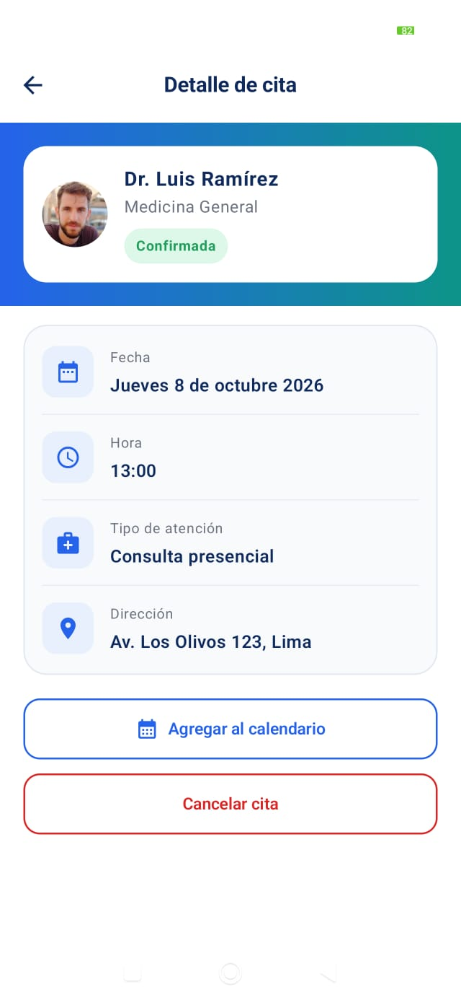 | DetalleCitaScreen con cabecera degradada, botón de calendario y AlertDialog de cancelación |
| 25 | Filtros y Buscador en Resultados | 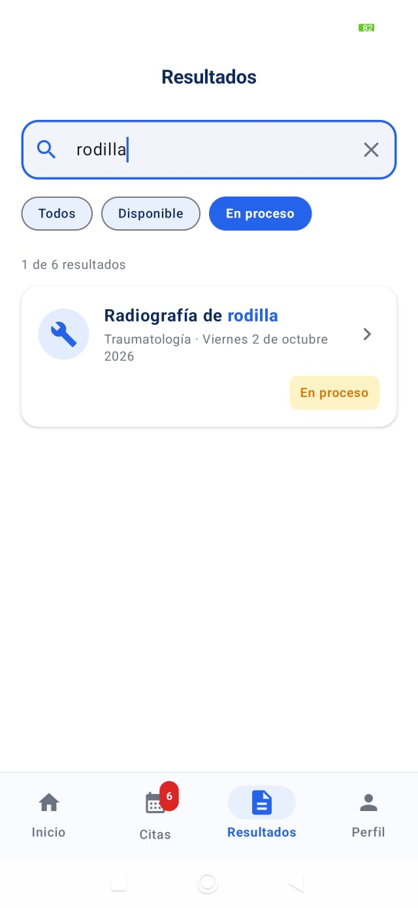 | ResultadosScreen con chips "Todos", "Disponible", "En proceso" y buscador en tiempo real |
| 26 | Detalle de Resultado y Compartir | 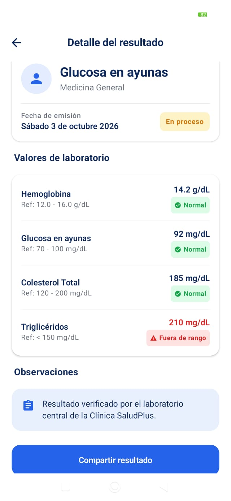 | `ResultadoDetalleScreen` con tabla de parámetros de laboratorio y función "Compartir resultado" |
| 27 | Edición de Perfil y Estadísticas | 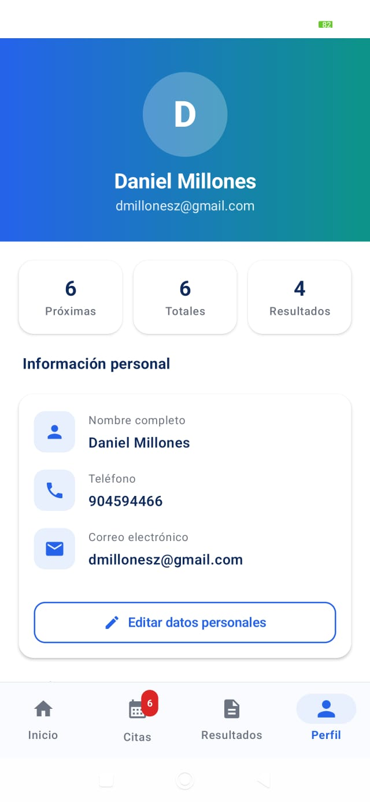 | PerfilScreen con contadores animados, toggle de sonido y diálogo de actualización de datos |
| 28 | Notificaciones Clicables e Indicadores | 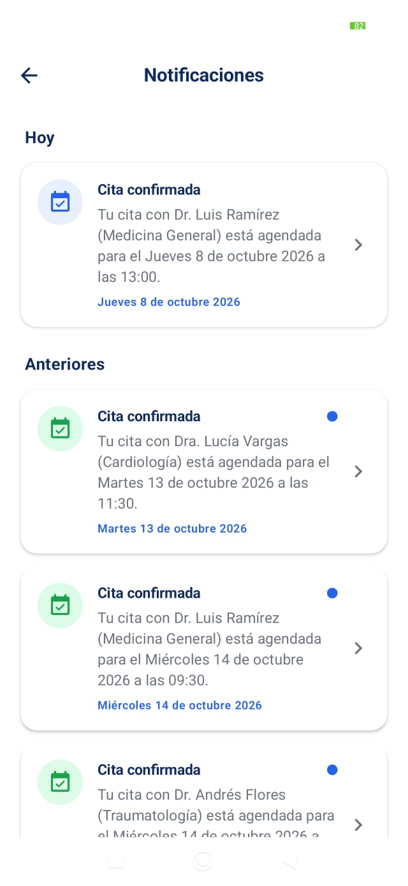 | NotificacionesScreen con punto azul para no leídas y agrupación por fecha ("Hoy / Anteriores") |
| 29 | Notificación Nativa del Sistema | 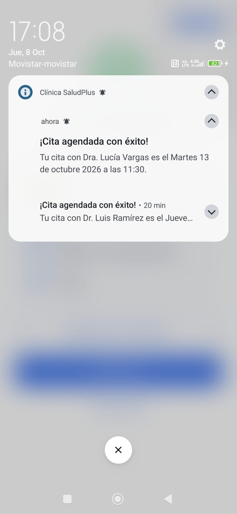 | Notificación emergente Android (`NotificationChannel`) con sonido o silenciosa al agendar |
| 30 | Barra de Progreso en Términos | 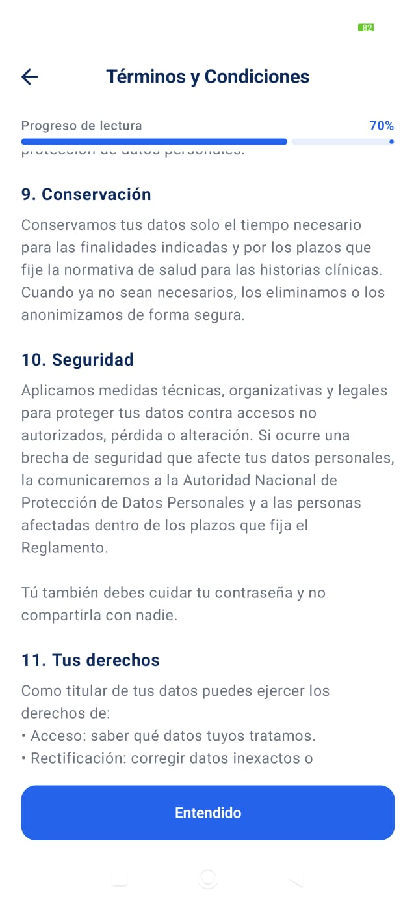 | TerminosScreen con indicador superior de lectura según scroll y botón "Entendido" fijo |

## 7. Flujo de navegación

```text
Splash → Registro o Login → Inicio → Especialidades → Médicos(especialidadId) → FechaHora(medicoId) → ConfirmarCita(medicoId, fecha, hora) → Cita agendada → Mis citas
```

- Menú lateral hamburguesa (`ModalNavigationDrawer`) en `Inicio` con navegación a todas las secciones.
- `NavigationBar` animada con píldora de selección e `Insignia` sobre Citas.
- `AppNavigation` maneja transiciones suaves de entrada y salida con deslizamiento y fundido.

## 8. Funciones del Repositorio

- `registrarUsuario`: Comprueba duplicado con `any` y agrega con `add`.
- `iniciarSesion` y `cerrarSesion`: Búsqueda con `find` y actualización de `usuarioActual`.
- `actualizarUsuario`: Actualiza nombre y teléfono del usuario en sesión.
- `buscarEspecialidades`: Filtrado con `filter` + `contains`.
- `especialidadesDestacadas`: Retorna los primeros elementos con `take(5)`.
- `obtenerEspecialidad`, `obtenerMedico`, `obtenerCita`: Búsqueda por id con `find`.
- `medicosPorEspecialidad` y `buscarMedicos`: Filtrado con `filter` y ordenamiento por calificación con `sortedByDescending`.
- `horariosDisponibles`: Filtrado con `filter` + `map`; oculta las horas ya reservadas por médico y fecha.
- `agendarCita`: Comprobación con `any` y guardado con `add`.
- `citasDelUsuario`: Filtrado con `filter` y ordenamiento con `sortedWith`.
- `cancelarCita`: Eliminación de cita con `removeIf`.
- `consumirMensajeBienvenida`: Control de exhibición única del mensaje de bienvenida por inicio de sesión.

## 9. Pruebas manuales

| Caso | Pasos | Resultado esperado | Estado |
|---|---|---|---|
| 1 | Registro con campos vacíos | Muestra los errores en pantalla | OK |
| 2 | Teléfono solo de 9 dígitos | Intenta ingresar teléfono distinto de 9 dígitos | Solo permite exactamente 9 dígitos | OK |
| 3 | Casilla de Términos | Intentar registrarse sin marcar la casilla | El botón "Registrarme" permanece deshabilitado | OK |
| 4 | Conservación de datos | Escribir datos en Registro, abrir Términos y volver | Los campos se conservan al volver | OK |
| 5 | Correo repetido | Intentar registrar un correo que ya existe | Muestra "Este correo ya está registrado" | OK |
| 6 | Validaciones de Login | Probar credenciales incorrectas y correctas | Muestra error con incorrectas; entra a Inicio con correctas | OK |
| 7 | Atrás en Inicio | Presionar el botón Atrás desde la pantalla de Inicio | Cierra la aplicación | OK |
| 8 | Búsqueda en Especialidades | Buscar "car" y buscar "zzz" | "car" muestra Cardiología; "zzz" muestra mensaje de lista vacía | OK |
| 9 | Ordenamiento de Médicos | Abrir el listado de médicos de una especialidad | Aparecen ordenados de mayor a menor calificación | OK |
| 10 | Selección de día y hora | Elegir día y cambiar de día en Fecha y hora | "Continuar" solo se habilita con día y hora elegidos; cambiar día reinicia la hora | OK |
| 11 | Bloqueo de horario reservado | Reservar un horario y revisar disponibilidad | El horario reservado no aparece para ese médico y fecha, pero sigue libre con otro médico | OK |
| 12 | Navegación tras confirmar | Confirmar cita y presionar Atrás desde Cita agendada | No regresa al flujo de agendamiento | OK |
| 13 | Mis citas | Entrar a Mis citas sin citas y con citas | Muestra mensaje y botón "Agendar cita" si no hay citas; con citas las ordena por fecha y hora | OK |
| 14 | Cancelación de cita | Cancelar una cita desde Detalle de cita aceptando el AlertDialog | Elimina la cita y libera el horario | OK |
| 15 | Cierre de sesión | Presionar "Cerrar sesión" en Perfil y presionar Atrás | Lleva a Splash y presionar Atrás cierra la app | OK |
| 16 | Citas por usuario | Iniciar sesión con usuarios distintos | Cada usuario ve únicamente sus propias citas y notificaciones | OK |

## 10. Limitaciones y decisiones de diseño

- **Datos en memoria:** Todo vive en memoria en `Repositorio`. No se utiliza base de datos ni persistencia local (Room, SharedPreferences, DataStore).
- **Notificaciones locales:** Se emplean `NotificationChannel` y `PendingIntent` locales sin backend ni Firebase FCM.
- **Formato del selector de mes:** Muestra 12 meses futuros a partir del mes actual del sistema.
- **Fotos de médicos:** Coil 2.7.0 requiere internet para cargar fotos desde `randomuser.me`; sin conexión se muestran iniciales.

## 11. Fase 2 — Mejoras con IA (`con-ia`)

En la Fase 2 (`con-ia`) se completaron la mejora obligatoria y las mejoras integrales del sistema:

1. **Calendario dinámico (`java.time.LocalDate`):** Días hábiles dinámicos a partir de hoy, navegación semanal, bloqueo de fechas pasadas y formato en texto extendido en español ("Martes 16 de setiembre 2026").
2. **Selector desplegable de mes:** Despliegue de 12 meses futuros con `ModalBottomSheet` e integración fluida con la cuadrícula del calendario.
3. **Sistema de diseño y tokens:** `Disenio.kt`, `Type.kt` con tipografía de Material 3, degradados, esquinas redondeadas (20-24 dp), `EstadoVacio`, `ChipFiltro`, `Insignia`, `Esqueleto` shimmer y microinteracciones.
4. **Mensajes globales y transiciones:** `MensajeController` y `MensajeHost` para reemplazar los `Toast`, junto con animaciones de entrada/salida en el `NavHost`.
5. **Notificaciones del sistema:** Canales con sonido y silencioso (`citas_sonido`, `citas_silencioso`), permiso `POST_NOTIFICATIONS` en Android 13+ y apertura directa de `DetalleCitaScreen` mediante `PendingIntent`.
6. **Rediseño completo de pantallas:** Splash animado, Login/Registro con animaciones y validación, Inicio con cuenta regresiva y mensaje de bienvenida dinámico, menú hamburguesa con `ModalNavigationDrawer`, navegación con píldora animada, Especialidades y Médicos con resaltado y estrellas, Confirmar/Cita agendada con ticket y confeti, Mis Citas con pestañas y swipe to dismiss, Resultados con pantalla de detalle y opción de compartir, Perfil con estadísticas y edición, Notificaciones clicables y Términos con barra de progreso.

## 12. Registro de Prompts

La documentación del prompt principal asignado, la respuesta resumida y el detalle de las correcciones realizadas se encuentra registrada en el archivo [PROMPTS.md](./PROMPTS.md).

## 13. Autor

- **Autor:** Daniel Alejandro Millones
- **Curso:** Programación en Móviles (Sección D). Laboratorio 6 complementario, Semana 6.
